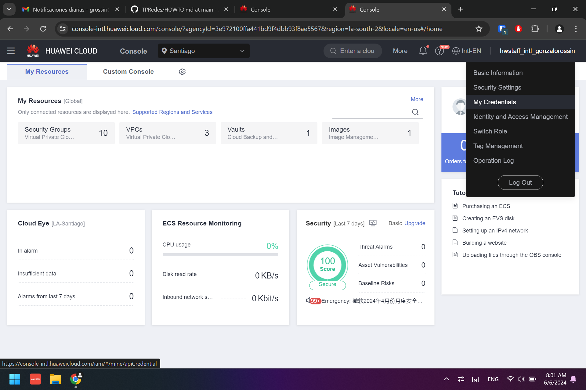
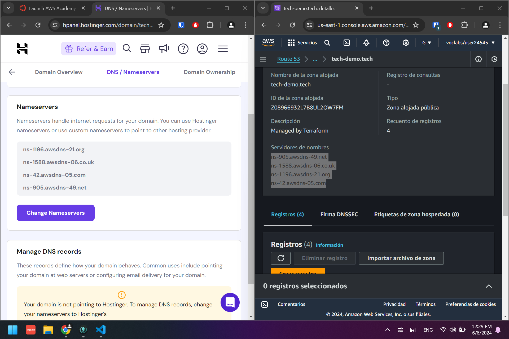
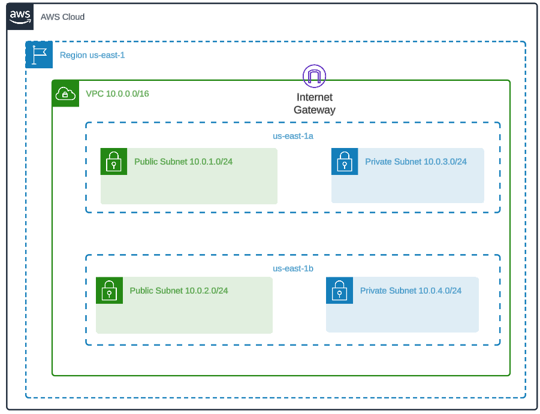
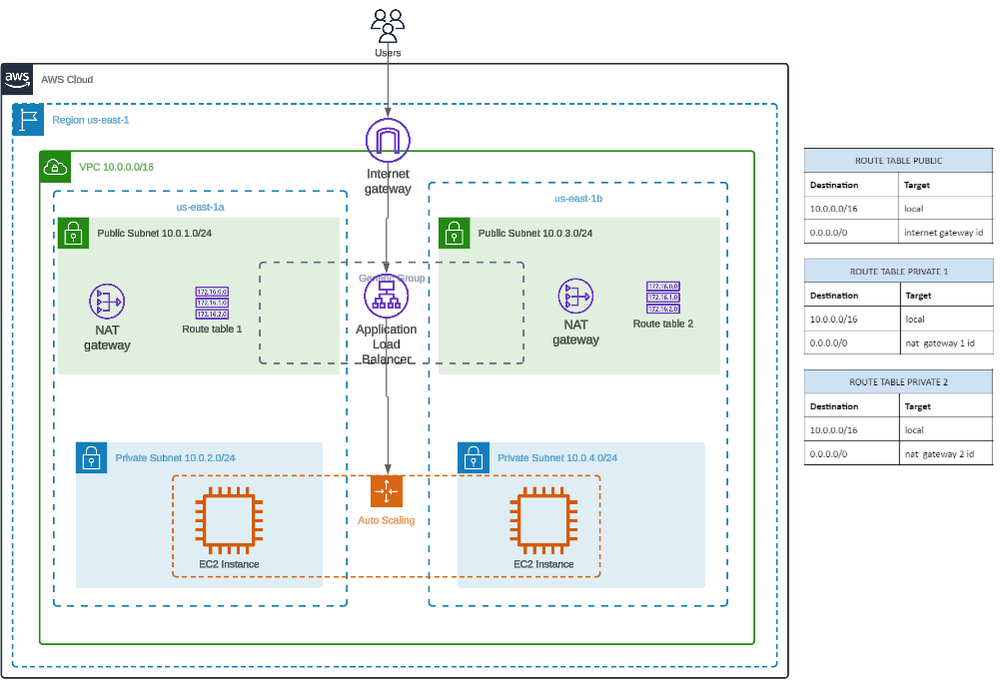
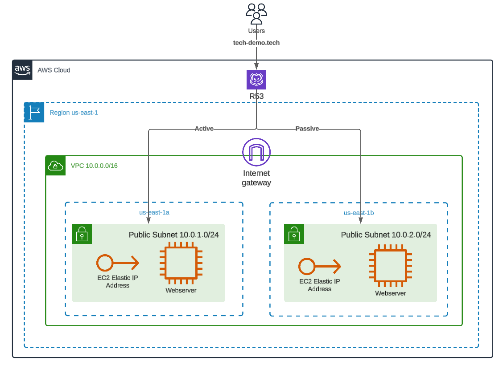
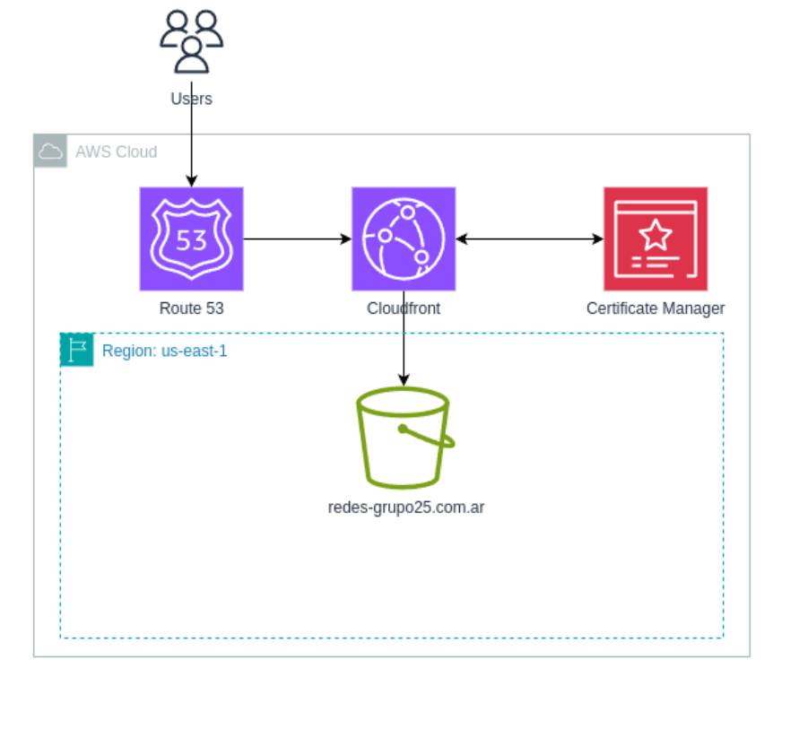
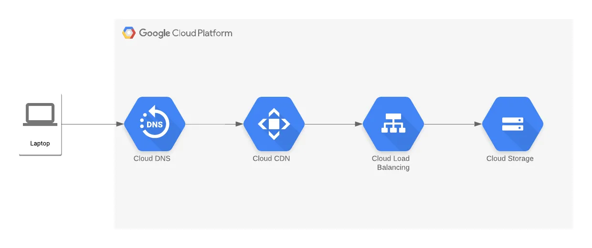
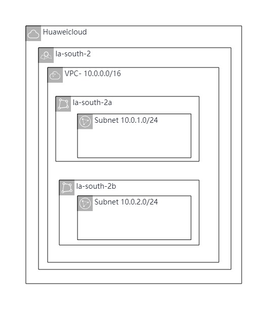
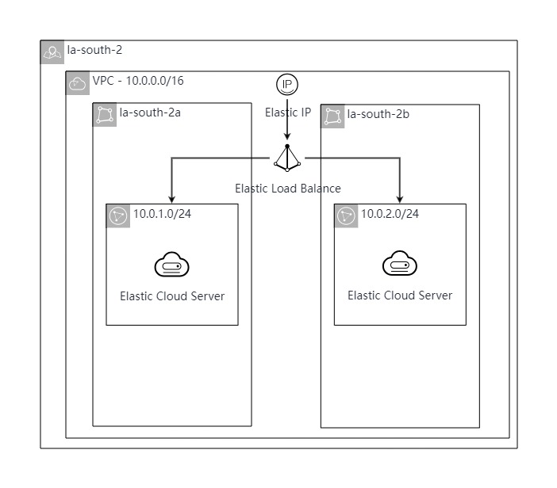

# Trabajo Práctico Especial - Redes de Información - Infraestructura como código

Autores:

- Espina, Segundo
- Limachi, Desiree
- Rossin, Gonzalo
- Ruiz, Mateo

### Requisitos

- [Git](https://git-scm.com/book/en/v2/Getting-Started-Installing-Git)
- [AWS CLI](https://docs.aws.amazon.com/cli/latest/userguide/getting-started-install.html)
- [Terraform](https://www.terraform.io/downloads.html)
- [GCP CLI](https://cloud.google.com/sdk/docs/install?hl=es-419)

## Clonar repositorio

Para clonar el repositorio
utilizando ssh ejecutar:

```
git clone git@github.com:sespina99/TPRedes.git
```

utilizando https ejecutar:

```
git clone https://github.com/sespina99/TPRedes.git
```

o descargar `.zip` desde [github](https://github.com/sespina99/TPRedes)


## Obtener credenciales

### AWS

Si se encuentra desde <b>AWS Academy</b>, podrán encontrar las credenciales al inicializar el Learner Lab, luego visualizar "detalles AWS" 

```
Cloud Access

   AWS CLI:   
    [default]
    aws_access_key_id= **ACCESSKEY
    aws_secret_access_key= **SECRETKEY
    aws_session_token= **TOKEN
```

Posteriormente se deben setear las credenciales correspondientes de AWS en el archivo que podrá encontrar en:

Mac/Linux:
```
~/.aws/credentials
```
Windows:
```
C:\Users\username\.aws\credentials
```


Si se encuentra en <b>AWS</b>, se debe crear un usuario en AWS con permisos de administrador, para esto, se dirigirá a Roles, crear un rol. Elegir un rol de administrador para la cuenta iniciada. 
Configure el nombre del rol y podrá acceder a las credenciales.


Podrá consultar si estan correctamente configuradas las credenciales a partir de:
```
aws configure
```
```
AWS_ACCESS_KEY_ID= **
AWS_SECRET_ACCESS_KEY= **
AWS_SESSION_TOKEN= **
```

### Huawei Cloud

Si se encuentra desde <b>Huawei Cloud</b>, debe crear las llaves  de acceso necesarias. Desde la consola, encontrará el menu "Mis credenciales" en donde podra crear un nuevo par de access_key_id:secret_access_key. Luego de haber creado el par desde la consola se descargara en su PC un archivo "credentials.csv" con las credenciales adentro.



Posteriormente, deberá configurar las siguientes variables de entorno: 
```
$ exportar HW_REGION_NAME="cn-norte-1"
$ exportar HW_ACCESS_KEY="mi-clave-de-acceso"
$ exportar HW_SECRET_KEY="mi-clave-secreta"
```

Alternativamente, es posible setear las claves como variables dentro de un archivo .tfvars que sera usado por terraform para levantar los recursos en su cuenta.

### GCP

Si se encuentra dentro de <b>GCP</b> debe crearse un usuario de GCP con su cuenta de google. Una vez creada su cuenta, la forma más segura de correr terraform con gcp desde su máquina local es descargando gcp.
Una vez descargado gcp correr el siguiente comando en la terminal:

```
gcloud auth application-default login
```
Este comando abrirá una ventana en su navegador para que pueda iniciar sesión con su cuenta de google y su estación de trabajo quedará autenticada para correr terraform con gcp. También es necesario crear o elegir el proyecto de google cloud donde quiere implementar la infraestructura desde la consola de gcp, una vez elegido guardar el id del proyecto para utilizarlo como variable en terraform.

## Instrucciones

### Uso de terraform

En cada carpeta se va a encontrar con el requerimiento de proveedor a utilizar, donde va a tener las siguientes caracteristicas:

- source: Especifica la ubicación del proveedor. 
- version: Especifica la versión del proveedor que se debe utilizar.

Se tiene los siguientes bloques correspondiente a cada proovedor.

```
terraform {
  required_providers {
    aws = {
      source  = "hashicorp/aws"
      version = ">= 5.0"
    }
  }
}
```

```
terraform {
  required_providers {
    huaweicloud = {
      source = "huaweicloud/huaweicloud"
      version = ">= 1.20.0"
    }
  }
}
```

```
terraform {
  required_providers {
    google = {
      source = "hashicorp/google"
      version = ">= 4.0.0"
    }
  }
}
```

### Crear archivos .tf

Para la creación y organización de un script, se va a requerir de un <b>main</b> principal, donde estara declarado lo anterior mencionado y luego los componentes requeridos

#### * Organización en modulos

Se puede optar por tener una carpeta separada en modulos, donde se separara en carpetas cada compenente utilizado, de la siguiente manera:

    |_main.tf
    |_modules
        |_componente
            |_main.tf
            |_output.tf
            |_variables.tf

Este formato ayuda a la organización para poder encontrar, modificar o buscar datos necesarios a utilizar en el componente, en cada archivo podrán encontrar. Adicionalmente permite reutilizar los modulos para diferentes combinaciones de infraestructura segun sea necesario

- main: Definición del funcionamiento general del componente, para utilizar los valores de entrada definidos en "variables" se tendrá que utilizar "var.name_variable".
- outputs: Variables de salida
- variables: Variables de entrada

#### * Organización por archivos

Por otro lado, se puede optar por tener los archivos con el nombramiento de cada componente para definir el funcionamiento, y reutilizar los parametros creados para cada componente en los demás, sin la necesidad de utilizar variables en el medio.


### Correr el proyecto

Se debe dispone de un archivo de variables de extension <i>.tfvvars</i> con los nombres a utilizar para los componentes en cada script, si desea modificar los mismos podrá realizarlos dentro de este archivo sin la necesidad de ingresar a cada componente.

Para ejecutar el proyecto se deben realizar las siguientes instrucciones en una terminal situada en el directorio raiz del mismo:

```
$ cd TPRedes

$ cd [nombreScript]

$ terraform init

$ terraform plan 

$ terraform apply 
```

El comando ```terraform init``` imprime la versión del proveedor Terraform instalada. También crea un archivo de bloqueo denominado .terraform.lock.hcl, que especifica las versiones exactas del proveedor utilizadas para garantizar que cada ejecución de Terraform sea coherente.

Opcionalmente, podrá correr el comando ```terraform validate``` para asegurarse de que su configuración sea sintácticamente válida y coherente internamente.

Con el comando ```terraform plan``` se genera y muestra un plan de ejecución de Terraform, indicando los cambios que se realizarán en la infraestructura sin aplicarlos aún.

A partir de ```terraform apply``` se indicará qué cambios de infraestructura se planeo realizar y solicitará su aprobación antes de realizar esos cambios. Si el plan le parece aceptable, podrá escribir ```yes``` en el mensaje de confirmación para continuar. Es posible que Terraform tarde unos minutos en aprovisionar la red.

```
Apply complete! Resources: 1 added, 0 changed, 0 destroyed.
```

Luego de visualizar el mensaje anterior, ya ha creado infraestructura utilizando Terraform!


Adicionalmente, si desea destruir el proyecto, tendrá la posibilidad de realizarlo a partir del comando ```terraform destroy``` que elimina todos los recursos gestionados por la configuración de Terraform.

### Módulos utilizados

A continuación se presenta la lista de los módulos utilizados en el proyecto. Separando por cada proovedor los servicios.

AWS:

- <b>Route 53:</b> Utilizado para generar los registros de DNS necesarios para exponer la CDN.
- <b>S3:</b> Utilizado para servir el frontend de la aplicación.
- <b>CloudFront:</b> Utilizado para recibir las requests del Route 53 y servirle el frontend de la aplicación al usuario. Con esto se logra que el s3 de la website estática solo puede ser accedido desde el cloudfront.
- <b>VPC:</b> Utilizado para crear una red virtual en la arquitectura que contiene las capas de aplicación y base de datos del proyecto, junto con todas sus componentes (subnets, cidrs, etc).
- <b>EC2:</b> Utilizado para ejecutar las instancias del sitio web. En este proyecto, se configuraron algunas instancias EC2 en un Auto Scaling Group (ASG) para asegurar alta disponibilidad y escalabilidad automática basada en la demanda de tráfico.
- <b>Internet Gateway:</b> Utilizado para permitir que los recursos dentro de la VPC tengan acceso a internet y también puedan recibir tráfico desde internet. 
- <b>NAT Gateway:</b> Utilizado para permitir que las instancias en subnets privadas puedan acceder a internet de manera segura sin exponer sus direcciones IP privadas. 
- <b>ACM:</b> Certificado SSL para el dominio del sitio web estatico.


GCP:

- <b>Cloud Storage:</b> Utilizado para almacenar el frontend del sitio web (bucket <i>www.</i>, <i>redes.com</i>). 
- <b>Cloud DNS:</b> Utilizado para generar los registros de DNS.
- <b>Cloud CDN:</b> Para activar la CDN se habilitó un google compute storage bucket, que apunta al bucket de la web estatica. A este bucjket se le habilitó la opción de CDN.
- <b>Cloud Load Balancing:</b> Con el uso de un google compute https proxy se logra que el dominio sea servido por https. Este utiliza un google compute url map que redirige el tráfico al bucket de la web estatica. Se utiliza el proxy con una global forwarding rule que redirige el tráfico para que sea https.


Huawei Cloud:
- <b>VPC:</b> Utilizado para crear una red virtual en la arquitectura que contiene las capas de aplicación y base de datos del proyecto, junto con todas sus componentes (subnets, cidrs, etc).
- <b>ECS:</b> Utilizado para ejecutar las instancias del sitio web. 
- <b>ELB:</b> Utilizado para distribuir automáticamente el tráfico de red entrante entre múltiples instancias de ECS.


### Scripts disponibles
Dentro de este repositorio van a poder encontrar distintos scripts para levantar las distintas infraestructuras solicitadas en la consigna. Se podrá visualizar el diagramada en la sección "Diagrama de arquitectura". En cada carpeta podremos encontrar los siguientes scripts:

- <b>aws</b>: dentro de esta carpeta se puede encontrar dos scripts diferentes. El primer script ubicado en la carpeta "network_deploy" hara el deploy de una red en aws, esto consiste en una vpc con subredes tanto publicas como privadas en su interior. El segundo script ubicado en la carpeta "active-passive" realizara el deploy de un ambiente activo pasivo manejado por el servicio de dns Route 53. Los diagramas de arquitectura para cada configuracion se podran encontrar al final de este documento. Para que el deploy activo-pasivo funcione es necesario que una vez levantada la infraestructura, se cambien los nameservers de un dominio propio por los de aws que provee la public hosted zone. De otra forma, el dns no sabra direccionar el dominio hacia la arquitectura de aws.



- <b>huawei</b>: dentro de esta carpeta se podra encontrar 2 scripts. El primero ubicado en la carpeta network_deploy levantar una red en Huawei Cloud mientras que la segunda carpeta llamada high-availability levantar una vpc con subredes multi AZ y webservers en cada subred cuyo trafico es manejado por un load balancer.

- <b>high availability</b>: dentro de esta carpeta podrá encontrar un script que implementa una VPC con subredes distribuidas en múltiples zonas de disponibilidad (multi-AZ). El script también despliega un sitio web sencillo en cada una de estas subredes. Un load balancer que se encarga de gestionar el tráfico entrante, garantizando que si una de las instancias o zonas de disponibilidad falla, el tráfico se redirija a las instancias disponibles restantes. Esto asegura que el sitio web mantenga su disponibilidad y rendimiento óptimo incluso en caso de fallos en alguna parte de la infraestructura.

- <b>route 53 zone:</b> antes de desplegar la hosted zone es necesario tener un domino propio. Dentro de esta carpeta podrá encontrar un script, este es el primer paso para poder hostear sitios estaticos, ya que se requiere de tener la zona dns para poder luego verificar el certificado SSL, esta parte requiere hacer cosas fuera de terraform.
  Una vez que se desplegó la Hosted Zone, uno debe entrar al servicio de Route 53 en la consola de AWS, seleccionar la hosted Zone creada y copiar los records NS.
Una vez copiados ir a donde sea que tiene su domino registrado y registrarle a su dominio los nameservers por los que copió.
  
- <b>web-static-aws</b>: dentro de esta carpeta se encuentra el script que despliega el sitio web estatico en un bucket S3. Este script también despliega Cloudfront y le da una policy al bucket para ser privado y solamente accedido desde cloudfront. De esta manera se puede controlar el tráfico que le llega al bucket. También se conecta al cloudfront con la Hosted Zone creando los records debidos para redireccionar el tráfico desde el dominio hacia el Cloudfront mediante DNS. Por último también se crea un certificado SSL que garantiza que la conexión sea HTTPS.
Recordar correr el script de la carpeta route 53 zone primero y utilizar el mismo nombre de dominio en ese script y en este.

- <b>web-static-gcp</b>: dentro de esta carpeta se encuentra el script que despliega el web estático en GCP. Antes de correr el script el usuario debe registrar un dominio en la consola de gcp en el servicio de Cloud Domains. Una vez registrado en gcp se crea automáticamente una zona DNS, por lo que estamos listos para correr el script. El script crea el storage bucket con los archivos estaticos del sitio web. Crea un origin en la CDN con un bucket bucket que apúnta al storage bucket. Mediante un proxy https redirecciona el tráfico hacia el backend bucket con HTTPS.


## Diagramas de arquitectura

Para tener un mejor entendimiento de los scripts disponibles, se realizaron los siguientes driagramas, así podrá reutilizar las soluciones implementadas en el proyecto.

### AWS
### Solucion Deploy de una Red



### Solución Alta Disponibilidad



### Solución Ambiente Activo-Pasivo 



### Solución Sitio Web Estatico



### GCP

### Solución Sitio Web Estatico



### Huawei

### Solución Deploy de una Red



### Solución Alta Disponibilidad


