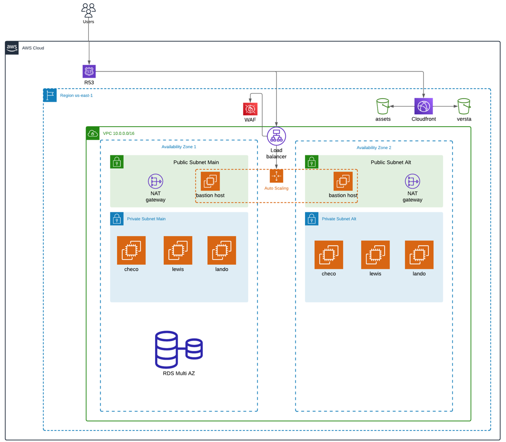
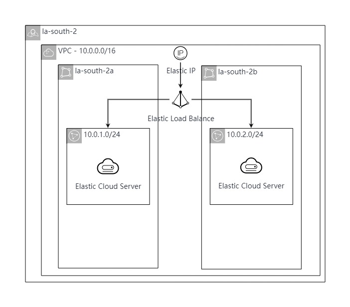

# Trabajo Práctico Especial - Redes de Información - Infraestructura como código

Autores:

- Espina, Segundo
- Limachi, Desiree
- Rossin, Gonzalo
- Ruiz, Mateo

### Requisitos

- [Git](https://git-scm.com/book/en/v2/Getting-Started-Installing-Git)
- [AWS CLI](https://docs.aws.amazon.com/cli/latest/userguide/getting-started-install.html)
- [Terraform](https://www.terraform.io/downloads.html)

## Clonar repositorio

Para clonar el repositorio
utilizando ssh ejecutar:

```
git clone git@github.com:sespina99/TPRedes.git
```

utilizando https ejecutar:

```
git clone https://github.com/sespina99/TPRedes.git
```

o descargar `.zip` desde [github](https://github.com/sespina99/TPRedes)


## Obtener credenciales

Si se encuentra desde la cuenta <b>Academy de AWS </b>, previamente se deben setear las credenciales correspondientes de AWS en el archivo que podrá encontrar en:
Mac/Linux:
```
~/.aws/credentials
```
Windows:
```
C:\Users\username\.aws\credentials
```

Si se encuentra en <b>AWS</b>, se debe crear un usuario en AWS con permisos de administrador y obtener las credenciales de este usuario. Podrá consultar si estan correctamente configurados a partir de:
```
aws configure
```
```
AWS_ACCESS_KEY_ID=
AWS_SECRET_ACCESS_KEY=
AWS_SESSION_TOKEN= 
```

Si se encuentra desde <b>Huawei Cloud</b>, debe crear las llaves  de acceso necesarias. Desde la consola, encontrará en el menú sus credenciales, luego podra crear un Access key a partir de el código de verificación o contraseña.

Posteriormente, deberá configurar las siguientes variables de entorno: 
```
$ exportar HW_REGION_NAME="cn-norte-1"
$ exportar HW_ACCESS_KEY="mi-clave-de-acceso"
$ exportar HW_SECRET_KEY="mi-clave-secreta"
```

Si se encuentra dentro de <b>GCP</b> 


## Instrucciones

### Uso de terraform

En cada carpeta se va a encontrar con el requerimiento de proveedor a utilizar:

```
terraform {
  required_providers {

    aws = {
      source  = "hashicorp/aws"
      version = ">= 5.0"
    }
    huaweicloud = {
      source = "huaweicloud/huaweicloud"
      version = ">= 1.20.0"
    }
    google = {
      source = "hashicorp/google"
      version = ">= 4.0.0"
    }

  }
}
```

### Crear archivos .tf

Para la creación y organización de un script, se va a requerir de un <b>main</b> principal, donde estara declarado lo anterior mencionado y luego los componentes requeridos

- Organización en modulos

Se puede optar por tener una carpeta separada en modulos, donde se separara en carpetas cada compenente utilizado, de la siguiente manera:

    |_main.tf
    |_modules
        |_componente
            |_main.tf
            |_output.tf
            |_variables.tf

Este formato ayuda a la organización para poder encontrar, modificar o buscar datos necesarios a utilizar en el componente, en cada archivo podrán encontrar
main: Definición del funcionamiento general del componente, para utilizar los valores de entrada definidos en "variables" se tendrá que utilizar "var.name_variable".
outputs: Variables de salida
variables: Variables de entrada

- Organización por archivos

Por otro lado, se puede optar por tener los archivos con el nombramiento de cada uno para definir el funcionamiento, y reutilizar los nombres creados para cada componente en los demás, sin la necesidad de utilizar variables en el medio.


### Correr el proyecto

Se debe disponer de un archivo de variables de extension <i>.tfvvars</i> con las variables definidas en el archivo cloud/variables.tf. Como modelo del mismo se provee el archivo cloud/terraform.example.tfvars.

Suponiendo que se cuenta con el archivo de variables en el path <i>path_variables</i>, para ejecutar el proyecto se deben realizar las siguientes instrucciones en una terminal situada en el directorio raiz del mismo:

```
$ cd TPRedes

$ terraform [-version] [-help] <command> [args]

$ terraform init

$ terraform plan -var-file="path_variables"

$ terraform apply -var-file="path_variables"
```


### Módulos utilizados

A continuación se presenta la lista de los módulos utilizados en el proyecto. Separando por cada proovedor los servicios.

AWS:

- <b>Route 53:</b> Utilizado para generar los registros de DNS necesarios para exponer la CDN.
- <b>S3:</b> Utilizado para servir el frontend de la aplicación (bucket <i>www.</i>, <i>redes.com</i>).
- <b>CloudFront:</b> Utilizado para recibir las requests del Route 53 y servirle el frontend de la aplicación al usuario. Con esto se logra que el s3 de la website estática solo puede ser accedido desde el cloudfront.
- <b>VPC:</b> Utilizado para crear una red virtual en la arquitectura que contiene las capas de aplicación y base de datos del proyecto, junto con todas sus componentes (subnets, cidrs, etc).
- <b>EC2:</b> Utilizado para ejecutar las instancias del sitio web. En este proyecto, se configuraron algunas instancias EC2 en un Auto Scaling Group (ASG) para asegurar alta disponibilidad y escalabilidad automática basada en la demanda de tráfico.
- <b>Internet Gateway:</b> Utilizado para permitir que los recursos dentro de la VPC tengan acceso a internet y también puedan recibir tráfico desde internet. 
- <b>NAT Gateway:</b> Utilizado para permitir que las instancias en subnets privadas puedan acceder a internet de manera segura sin exponer sus direcciones IP privadas. 

GCP:

- <b>Storage Bucket:</b> Utilizado para almacenar el frontend del sitio web (bucket <i>www.</i>, <i>redes.com</i>). 
- <b>Google Compute Engine:</b> Utilizado para la configuración del balanceador de carga, CDN y certificados
- <b>Google Cloud DNS:</b> Utilizado para generar los registros de DNS.

Huawei Cloud:
- <b>VPC:</b> Utilizado para crear una red virtual en la arquitectura que contiene las capas de aplicación y base de datos del proyecto, junto con todas sus componentes (subnets, cidrs, etc).
- <b>ECS:</b> Utilizado para ejecutar las instancias del sitio web. 
- <b>ELB:</b> Utilizado para distribuir automáticamente el tráfico de red entrante entre múltiples instancias de ECS.

### Diagrama de arquitectura






