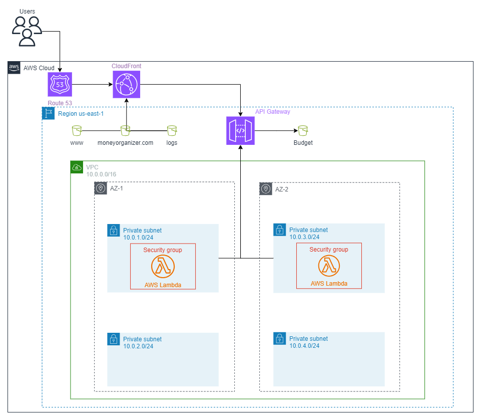

# 82.08 Cloud Computing - 2C 2023 (Grupo 1)

## TP 3 : Deployment de Recursos de infraestructura

### Instituto Tecnológico de Buenos Aires (ITBA)

## Integrantes

- [Natali Lilienthal](https://github.com/natu17) - Legajo 60544
- [Segundo Espina](https://github.com/sespina99) - Legajo 60150
- [Santiago Ferraris](https://github.com/sferraris) - Legajo 60129
- [Igal Leonel Revich](https://github.com/irevich) - Legajo 60390

## Rubrica de participación

| Alumno            | Legajo           | Participación   |
| ----------------- |:----------------:| :--------------:|
| Natali Lilienthal | 60544            | 25%             |
| Segundo Espina    | 60150            | 25%             |
| Santiago Ferraris | 60129            | 25%             |
| Igal Leonel Revich| 60390            | 25%             |


## Indice

- [82.08 Cloud Computing - 2C 2023 (Grupo 1)](#8208-cloud-computing---2c-2023-grupo-1)
  - [TP 3 : Deployment de Recursos de infraestructura](#tp-3--deployment-de-recursos-de-infraestructura)
    - [Instituto Tecnológico de Buenos Aires (ITBA)](#instituto-tecnológico-de-buenos-aires-itba)
  - [Integrantes](#integrantes)
  - [Rubrica de participación](#rubrica-de-participación)
  - [Indice](#indice)
  - [Descripción del proyecto](#descripción-del-proyecto)
  - [Ejecución](#ejecución)
    - [Consideraciones iniciales](#consideraciones-iniciales)
    - [Instrucciones](#instrucciones)
  - [Módulos utilizados](#módulos-utilizados)
  - [Componentes a evaluar](#componentes-a-evaluar)
  - [Funciones y meta-argumentos utilizados](#funciones-y-meta-argumentos-utilizados)
    - [Funciones](#funciones)
    - [Meta-argumentos](#meta-argumentos)
  - [Limitaciones](#limitaciones)
  - [Diagrama de arquitectura](#diagrama-de-arquitectura)

## Descripción del proyecto

El proyecto llevado a cabo consiste en el desarrollo de una aplicación web para gestión de gastos personales y documentos de pago, donde los usuarios puedan realizar diversas operaciones sobre sus respectivos gastos (agregar, modificar, eliminar, etc), visualizar un historial de los mismos, y en el caso de tratarse de empresas, compartir diversos presupuestos a otros.

## Ejecución

### Consideraciones iniciales

Para ejecutar el proyecto, previamente se deben setear las credenciales correspondientes de AWS en el archivo ~/.aws/credentials (Mac/Linux) o C:\Users\username\\.aws\credentials (Windows). A su vez, se debe disponer de un archivo de variables de extension <i>.tfvvars</i> con las variables definidas en el archivo cloud/variables.tf. Como modelo del mismo se provee el archivo cloud/terraform.example.tfvars. En caso de correrse los comandos correspondientes de ejecucion sin especificar el archivo de variables, las mismas seran pedidas por consola una por una. Por último, para la ejecución del proyecto se requiere una versión de Terraform mayor o igual que la 1.5.7.

### Instrucciones

Suponiendo que se cuenta con el archivo de variables en el path <i>path_variables</i>, para ejecutar el proyecto se deben realizar las siguientes instrucciones en una terminal situada en el directorio raiz del mismo:


```
$ cd cloud

$ terraform init

$ terraform plan -var-file="path_variables"

$ terraform apply -var-file="path_variables"
```

## Módulos utilizados

A continuación se presenta la lista de los módulos utilizados en el proyecto. Los mismos son <i>custom-made</i>, a menos que se especifique lo contrario:

- <b>Route 53:</b> Utilizado para generar los registros de DNS necesarios para exponer la CDN.
- <b>S3:</b> Utilizado para servir el frontend de la aplicación (buckets <i>www.</i>, <i>moneyorganizer.com</i> y <i>logs</i>), y almacenar los diversos presupuestos compartidos (bucket <i>budgets</i>). Para este se utilizó el módulo externo <i>https://registry.terraform.io/modules/terraform-aws-modules/s3-bucket/aws/</i>. Cabe aclarar que el módulo creado en el proyecto es <i>buckets_s3</i>, el cual contiene adentro el módulo de s3 creado con el módulo externo especificado.
- <b>CloudFront:</b> Utilizado para recibir las requests del Route 53 y servirle el frontend de la aplicación al usuario, e interactuar con el API Gateway para otorgar funcionalidad a la misma. Con esto se logra que el s3 de la website estática solo puede ser accedido desde el cloudfront.
- <b>API Gateway:</b> Utilizado para ejecutar las diversas funciones lambdas pertenecientes a la capa de aplicación de la arquitectura.
- <b>VPC:</b> Utilizado para crear la VPC especificada en la arquitectura que contiene las capas de aplicación y base de datos del proyecto, junto con todas sus componentes (subnets, cidrs, etc). Para este se utilizó el módulo externo <i>https://registry.terraform.io/modules/terraform-aws-modules/vpc/aws/</i>. Cabe aclarar que el módulo creado en el proyecto es <i>network</i>, el cual contiene adentro el módulo de vpc creado con el módulo externo especificado, que contiene una cantidad de variables limitadas para la creación de nuestro proyecto en particular. Por otro lado, en cuanto a las subnets, se decidió crear las correspondientes a la capa de base de datos, aúnque las componentes correspondientes a las mismas se desarrollen directo para el final de la materia.
- <b>Lambda:</b> Se utilizan para desarrollar la funcionalidad correspondiente a la aplicación. Se aclara que en la variable <i>lambda_functions_paths</i> se indican tanto el path de los codigos que utilizaran las lambda (<i>source</i>) como el path donde se generaran los zip utilizados por las mismas (<i>output</i>), y que en el path donde estan los archivos de entrada deben estar los archivos de codigo que actualmente se encuentran en <i>cloud/resources/lambda</i>. Cabe aclarar tambien que todas las lambda actualmente estan mockeadas, de forma tal que todas devuelven un mensaje del estilo "<i>functionName</i>: Hello from Lambda!" (por ejemplo la funcion de getBudgets devuelve el mensaje "getBudgets: Hello from Lambda!" ). Para el final se modificaran dichas funciones por su comportamiento correspondiente, añadiendo a las mismas la interaccion con la capa de base de datos.

## Componentes a evaluar

Al no realizarse componentes de más, los componentes a evaluar son las mencionadas en la sección anterior.

## Funciones y meta-argumentos utilizados

### Funciones

Las principales funciones utilizadas en el proyecto fueron:

- <b>filebase64sha256:</b> Utilizada para calcular el hash correspondiente al .zip que consume cada función lambda.
- <b>cidrsubnet:</b> Utilizada para crear los cidr blocks correspondientes a las private subnets de la VPC.
- <b>flatten:</b> Utilizada para juntar listas de cidr blocks correspondientes a las private subnets de cada Availability Zone VPC.
- <b>fileset:</b> Utilizada para generar una lista con los distintos paths de los archivos de código correspondiente a cada función lambda.

A su vez se utilizaron funciones extra como <b>range</b> y <b>length</b> para diversos ciclos, y <b>replace</b> para la generación de los paths de los .zip a utilizar por las lambdas. Tambien se utilizan <b>sha1</b> y <b>jsonencode</b> para chequear si se debe realizar un redeploy o no del API Gateway.

### Meta-argumentos

Los meta-argumentos utilizados en el proyecto fueron:

- <b>for_each:</b> Utilizado como principal método de iteración a la hora de crear recursos, tales como las funciones lambda, los recursos, los buckets y metodos del API Gateway, entre otros.
- <b>count:</b> Utilizado para la creación de los diversos .zip a utilizar por cada función lambda, en el cual se debe iterar por los distintos paths de archivos de código para así generar el .zip correspondiente a cada uno. A su vez, para la creación de los buckets se utilizo para atribuir ciertos recursos a algunos buckets y a otros no.
- <b>lifecycle:</b> Utilizado en la creación del deployment del API Gateway, para indicar que en caso de existir uno previo, se debe primero crear el nuevo y luego destruir el anterior.
- <b>depends_on:</b> Utilizado cuando para la creación de un recurso se requiere que otro recurso ya se encuentre creado, como por ejemplo para crear el route53 record, que requiere el route 53 zone.

## Limitaciones
La principal limitación fue que no teníamos un dominio comprado. De esta manera se perjudica nuestro plan sobre dos servicios:
- <b>Route53:</b> Logra pasar el apply, pero no llega a rediirigir al cloudfront, ya que el dominio utilizado para el route53 no existe. Por ende la redirección nunca ocurre.
- <b>ACM:</B> Relacionado a lo primero, este no pasa el apply. Esto se debe a que para validar el certificado del ACM, se requiere del dominio del Route53, que no existe. Por ende, el ACM no puede validar el certificado y en el apply espera la validación del mismo hasta el timeout y tira error. De esta manera, se comentó al ACM y las partes donde se utilizaba el certificado.

Debido a estas limitaciones, es que no se logró obtener el desempeño buscado al utilizar ACM y Route53.

## Diagrama de arquitectura

